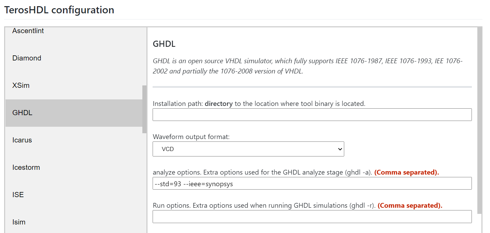

# Basic HDL
Description of basic digital circuits using HDL.
The development is generated by means of free software tools until the moment where punctual synthesis tools are required for a certain platform.

## Free sw packages used:
* [Teros HDL](https://terostechnology.github.io/terosHDLdoc/) (vscode framework)
* [GHDL + Yosys](https://github.com/YosysHQ/fpga-toolchain#installation) (simulation and synthesis)
* [Netlistsvg](https://github.com/nturley/netlistsvg) (Alternative schematic viewer)

## Config for GHDL in Teros HDL
The preset VHDL standard is from 2008, but this brings problems due to the lack of preconfiguration of the same in the installation of ghdl itself from Teros HDL. Therefore, the v93 standard can be configured to boot quickly.

For configure v08 standard:
Copy:
> <PATH>/fpga-toolchain/lib/ghdl/std/v08

to:
> /usr/lib/ghdl/mcode/vhdl/synopsys/